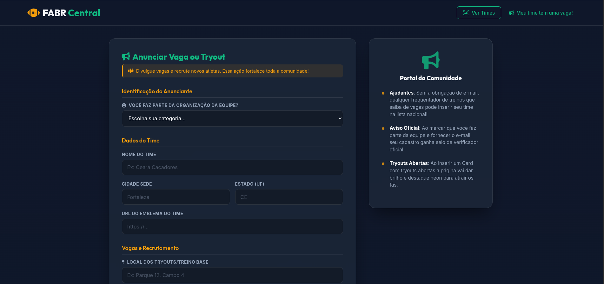

<div align="center">
  
</div>

# 🏈 FABR Central

**Bem-vindo(a) ao FABR Central!** O portal *Community-driven* para encontrar vagas, peneiras e times de Futebol Americano e Flag Football espalhados por todo o Brasil.

## 📋 Sobre o Projeto

Com o crescimento constante do futebol americano no Brasil (FABR), muitos novos praticantes enfrentam dificuldades para encontrar locais de treino, contatos com times e agendas de *Tryouts* (Peneiras). 

O **FABR Central** nasceu para solucionar esse problema através de uma comunidade colaborativa:
Em vez de depender de catálogos desatualizados, a própria comunidade ou os treinadores das equipes podem inserir as informações da sua franquia de forma fácil e rápida, gerando um mapa visual interativo para toda a nação.

## ✨ Principais Funcionalidades

- 🔍 **Vitrine Integrada de Busca**: Procure facilmente por state, team ou cidade.
- 🟢 **Badges de Peneiras em Destaque**: Identificação visual e luminosa ativada instantaneamente quando um time cadastra e marca que está com inscrições abertas (Tryouts).
- 📣 **Formulário Aberto à Comunidade**: Qualquer membro/fã pode anunciar vagas da sua região e fortalecer o ecossistema.
- 🏢 **Validação e Controle Oficial**: Membros de Diretorias/Team Orgs podem se identificar e registrar seus canais oficiais com credenciamento de veracidade perante os moderadores do app.
- 🎨 **Design Moderno (Glassmorphism)**: Interface construída com estéticas esportivas vibrantes, temas escuros contrastantes e componentes interativos desenhados da estaca zero.

## 🛠 Tecnologias Utilizadas

Este projeto front-end foi construído visando leveza, compatibilidade e alta performance visual:
- **HTML5** (Semântico)
- **CSS3 Vanilla** (Variáveis nativas, Flexbox, CSS Grid, Efeito *Glassmorphism*)
- **JavaScript Moderno** (ES6+, DOM Manipulation, Mocks assíncronos)
- **Google Fonts** (`Outfit` e `Inter`)
- **FontAwesome 6** (Ícone responsivos e dinâmicos)

* *Obs: O Backend e API consumidora estão projetados para arquitetura limpa e alta eficiência com PostgreSQL/Redis.*

## 🚀 Como Rodar o Projeto (Localmente)

1. Clone este repositório na sua máquina:
   ```bash
   git clone https://github.com/seunomedeusuario/FABR_Central.git
   ```
2. Acesse a pasta do projeto:
   ```bash
   cd FABR_Central
   ```
3. Nenhuma dependência pesada (como npm/node_modules) é necessária para a interface atual. Você pode abrir o projeto diretamente pelo navegador:
   ```bash
   # Abra o arquivo principal
   open index.html # ou duplo clique nativamente no arquivo!
   ```
   *(💡 Dica: Utilizar a extensão **Live Server** do VSCode é altamente recomendado para aprimorar o comportamento do recarregamento de assets.)*

## 🗺 Roadmap de Desenvolvimento
- [x] Template e estrutura base 
- [x] Funcionalidades de formulário para Peneiras / Org vs Fan.
- [x] Lógica visual JS / Mock DB implementada
- [ ] Desenvolvimento de Backend API em Typescript / Go.
- [ ] Integração com sistema de login Admin e moderação em fila de pendentes.

## 🤝 Contribuindo
Sugestões e *pull requests* de membros da comunidade do FA são incrivelmente bem vindos.
1. Faça um `Fork` do projeto.
2. Crie sua branch para a funcionalidade (`git checkout -b feature/MeuTimeNoMapa`).
3. Dê `Commit` nestas melhorias (`git commit -m 'Adicionando minha equipe na feature X'`).
4. Dê `Push` para sua branch (`git push origin feature/MeuTimeNoMapa`).
5. Por fim, abra um *Pull Request* aqui!

<p align="center">
Desenvolvido com 💚 e 🏈 para elevar o #FutebolAmericanoBr.
</p>
